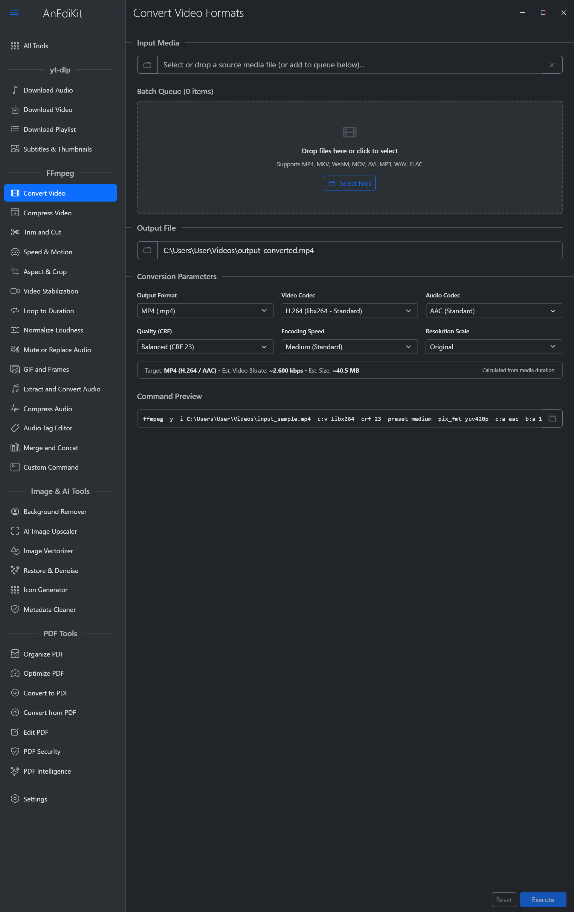
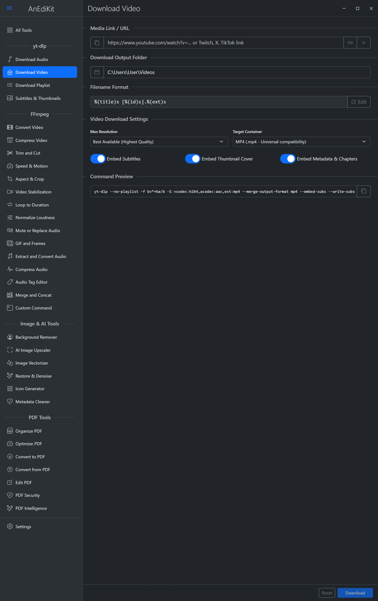
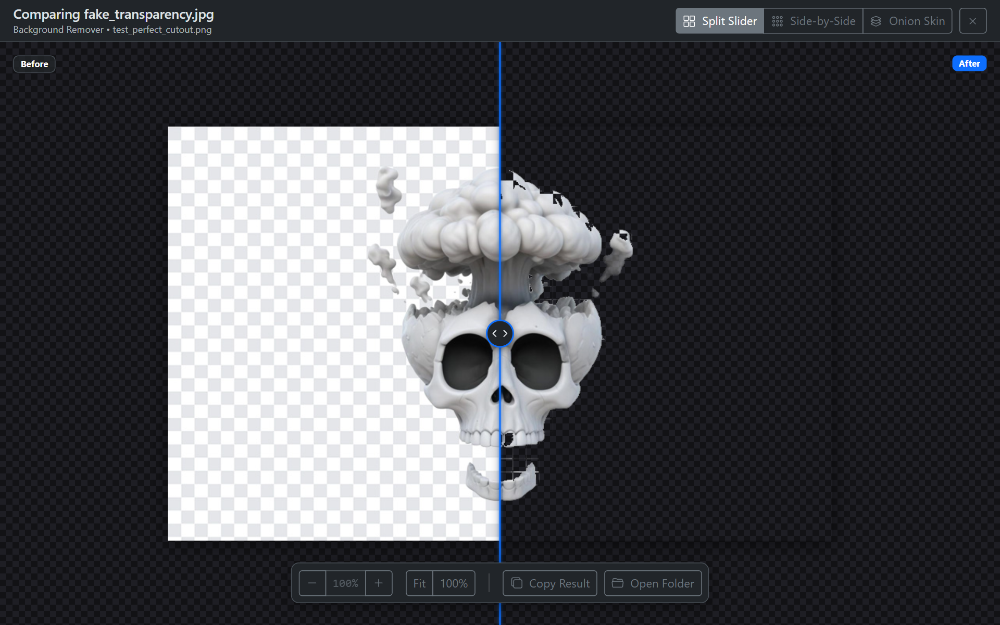

# AnEdiKit

AnEdiKit is a lightweight, all-in-one desktop toolkit for creators that combines FFmpeg video and audio utilities, a yt-dlp media downloader, and on-device neural processing into a single desktop application built with Tauri v2 and Rust. It also includes an extensible User Kits macro engine for creating custom GUI workflows with JavaScript.

## Screenshots


*Video Conversion: Transcode video formats with customizable codecs, quality presets, hardware acceleration, and live command preview.*


*Media Downloader: Download video and audio streams via yt-dlp with resolution presets, metadata embedding, and playlist support.*


*Image & AI Processing: Local neural background removal and enhancement with interactive split-slider before/after comparison.*

For full reference captures across all desktop tools, mobile views, and dialogs, see the [Screenshots Index](docs/screenshots/README.md).

## Features

### Video & Audio Processing (FFmpeg)
- Video Conversion: Transcode video files across MP4, MKV, WebM, MOV, AVI, and other formats with customizable codecs (H.264, HEVC, AV1, VP9), CRF quality presets, and resolution scaling.
- Audio Extraction & Conversion: Extract audio tracks from video or transcode audio files across MP3, M4A, FLAC, WAV, Opus, and OGG formats.
- Audio Tag & Metadata Editor: Edit ID3 tags (title, artist, album, track, year, genre) and manage embedded album artwork with a conjoined queue view.
- Precision Trimming & Cutting: Trim clips using instant lossless stream copying or frame-accurate re-encoding.
- Targeted Media Compression: Compress video and audio to fit target file sizes (Discord, WhatsApp, Email, or custom megabyte limits) with automatic bitrate budgeting.
- Media Concatenation & Merging: Join multiple video or audio tracks into a single continuous stream.
- Audio Track Replacement & Muting: Strip unwanted audio from video files or mux custom audio tracks with volume mixing.
- GIF & Frame Extraction: Generate high-quality animated GIFs with custom palette generation or export image sequence frames.
- Custom FFmpeg Execution: Run custom argument strings with real-time log output and stream progress tracking.

### Media Downloader (yt-dlp)
- Video & Audio Downloads: Download media streams in single video, audio-only (MP3, M4A, FLAC), and subtitle/thumbnail extraction modes.
- Playlist & Batch Queueing: Download full playlists and channels with dual-progress tracking for both current item and overall batch completion.
- Global Downloader Settings: Centralized configuration for browser cookie authentication (Chrome, Firefox, Edge, Brave, Opera, Vivaldi), download speed limits, SponsorBlock segment removal, and custom flags.

### On-Device Neural Processing (Image & AI)
- Background Remover: Isolate subjects and remove backgrounds locally without uploading files to third-party services.
- AI Image Upscaling: Enhance image resolution with deep learning super-resolution models.
- Image Vectorizer: Trace and convert raster graphics (PNG, JPG) into scalable SVG vectors.
- Interactive Comparison: Review results side-by-side or with a split slider before saving.

### Core Engine & Architecture
- Hardware Acceleration: Support for NVIDIA NVENC (CUDA), Intel QuickSync (QSV), AMD AMF, and DirectML hardware encoders with automatic CPU fallback.
- Non-Blocking Background Processing: Asynchronous process management keeps the interface responsive while long-running jobs execute in the background.
- User Kits Macro Engine: Create custom GUI tools and automated workflows with JavaScript, form controls, and Monaco editor integration.

## Development & Building

Comprehensive prerequisites, setup instructions, packaging options, and screenshot tooling are documented in [Building AnEdiKit](docs/building.md).

Quick start:
```bash
npm install
npm run tauri dev
```

Build release packages:
```bash
npm run build:release
```

## Tech Stack

- Desktop Framework: Tauri v2
- Backend Systems: Rust (`serde`, `serde_json`, `rfd`, `tauri-plugin-opener`)
- Frontend Interface: HTML5, CSS3, JavaScript (ES Modules), Bootstrap 5, Ionicons
- Media Processing: FFmpeg, yt-dlp
- AI Processing: Python 3, `rembg`, `onnxruntime`, `opencv-python`, `Pillow`

## License

This project is licensed under the MIT License. See the [LICENSE](LICENSE) file for details.
